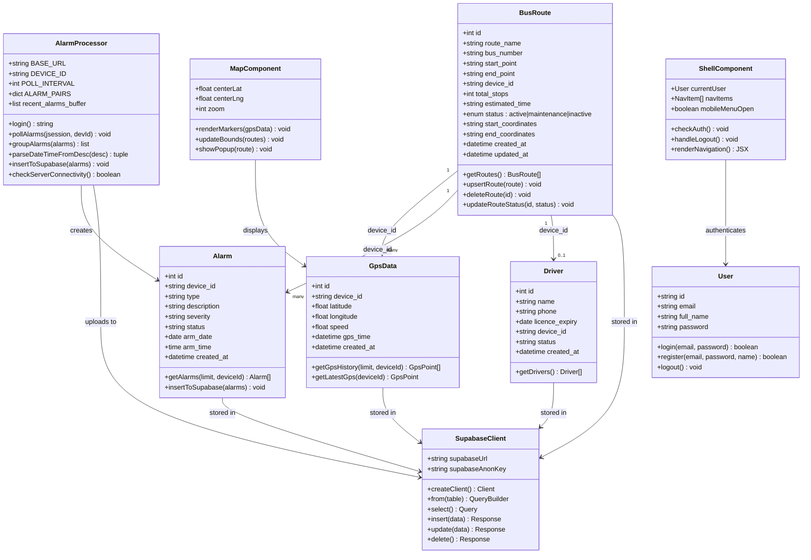
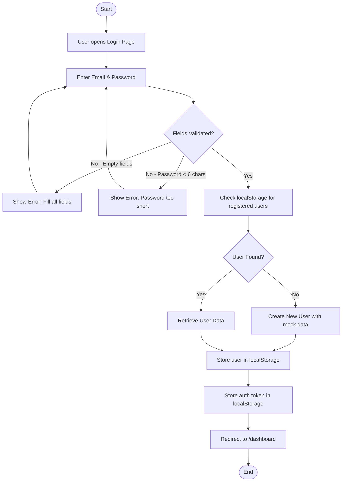
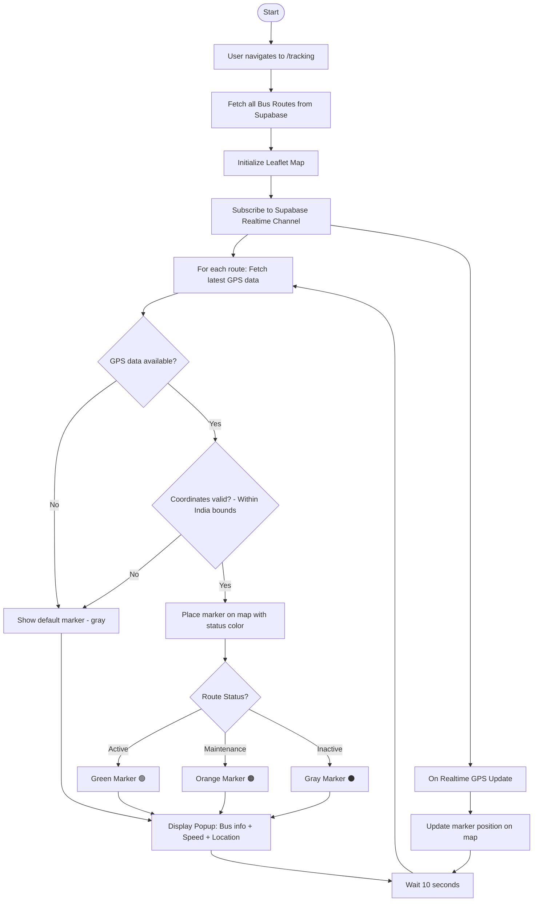
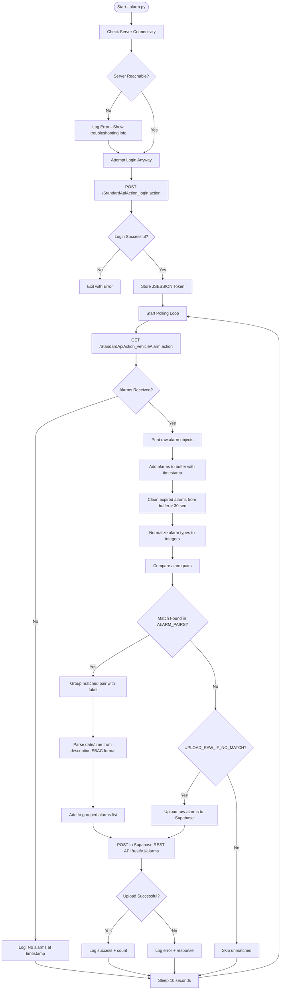
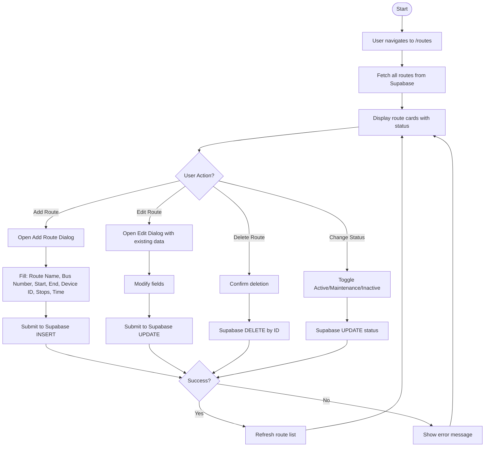
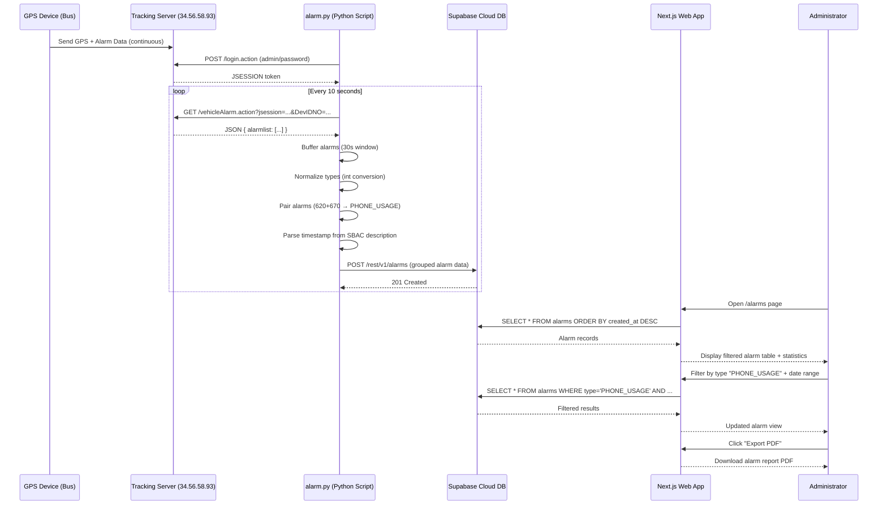
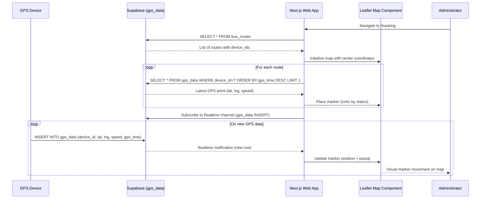
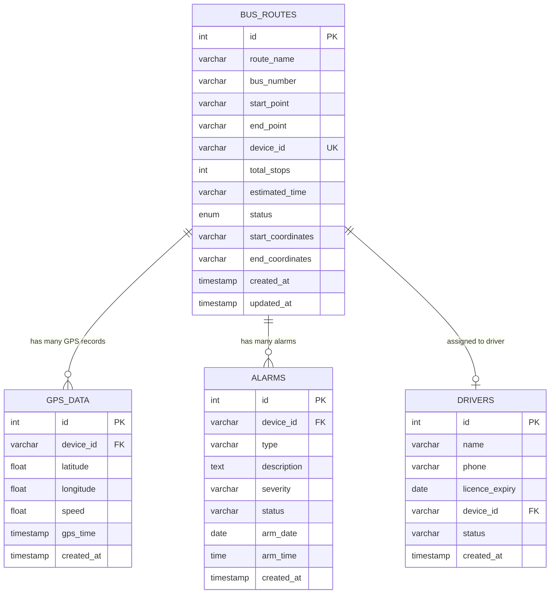

# 📘 REPORTING 2 — System Design & Database Development

## JG UNIVERSITY — SCHOOL OF COMPUTING
### SEM-IV — MCA (BATCH-2024) | INDUSTRIAL PROJECT

---

**Project Title:** Bus Buddy — School Bus Tracking & Fleet Management System  
**Technology Stack:** Next.js 14, React 18, TypeScript, Supabase (PostgreSQL), Tailwind CSS, Leaflet Maps, Python  
**Domain:** https://busbuddy.in.net  
**Submitted By:** _(Your Name & Enrollment No.)_  
**Industry Mentor:** _(Mentor Name)_  
**Company:** VAS Digitek — director@vasdigitek.net | +91 72838 68560

---

# TABLE OF CONTENTS

1. [System Design Overview](#1-system-design-overview)
2. [System Architecture Diagram](#2-system-architecture-diagram)
3. [UML Diagrams](#3-uml-diagrams)
   - 3.1 [Use Case Diagram](#31-use-case-diagram)
   - 3.2 [Class Diagram](#32-class-diagram)
   - 3.3 [Activity Diagrams](#33-activity-diagrams)
   - 3.4 [Sequence Diagram](#34-sequence-diagram)
   - 3.5 [Data Flow Diagram (DFD)](#35-data-flow-diagram-dfd)
4. [Data Dictionary](#4-data-dictionary)
5. [Database Schema (ER Diagram)](#5-database-schema-er-diagram)
6. [Technology Justification](#6-technology-justification)
7. [Module Description](#7-module-description)
8. [Screen Layouts / Wireframes](#8-screen-layouts--wireframes)
9. [API Design](#9-api-design)

---

# 1. System Design Overview

## 1.1 Introduction

Bus Buddy is a comprehensive school bus tracking and fleet management platform that combines **real-time GPS tracking**, **AI-powered safety monitoring (DMS/ADAS)**, **route management**, and **reporting** into a single web-based solution. The system integrates hardware (GPS trackers, MDVR cameras, DMS/ADAS sensors) with cloud infrastructure (Supabase/PostgreSQL) and a modern frontend (Next.js 14).

## 1.2 Design Goals

| Goal | Description |
|------|-------------|
| **Real-Time Tracking** | Live GPS updates every 10 seconds on an interactive map |
| **Safety First** | AI-based driver behavior monitoring (fatigue, phone usage, distraction) |
| **Scalability** | Cloud-hosted database supporting 1000+ schools |
| **Responsiveness** | Mobile-first design that works on all devices |
| **Reliability** | Automated alarm processing with buffering and retry logic |
| **Ease of Use** | Intuitive dashboard for non-technical school administrators |

## 1.3 System Components

```
┌──────────────────────────────────────────────────────────┐
│                    BUS BUDDY SYSTEM                       │
├──────────────┬──────────────┬─────────────┬──────────────┤
│  Hardware    │  Backend     │  Database   │  Frontend    │
│  Layer       │  Processing  │  Layer      │  (Web App)   │
├──────────────┼──────────────┼─────────────┼──────────────┤
│ GPS Tracker  │ Python       │ Supabase    │ Next.js 14   │
│ MDVR Camera  │ Scripts      │ PostgreSQL  │ React 18     │
│ DMS/ADAS     │ (alarm.py)   │ Realtime    │ TypeScript   │
│ Sensors      │              │ REST API    │ Leaflet Maps │
└──────────────┴──────────────┴─────────────┴──────────────┘
```

---

# 2. System Architecture Diagram

```
┌─────────────────────────────────────────────────────────────────────────┐
│                        SYSTEM ARCHITECTURE                              │
└─────────────────────────────────────────────────────────────────────────┘

  ┌──────────────┐     ┌──────────────────┐     ┌──────────────────────┐
  │  GPS Device  │────▶│  External GPS    │────▶│  Python Scripts      │
  │  (In Bus)    │     │  Tracking Server │     │  (alarm.py,          │
  │  ID:20260..  │     │  34.56.58.93     │     │   guid_tracker.py)   │
  └──────────────┘     └──────────────────┘     └──────────┬───────────┘
                                                           │
  ┌──────────────┐                                         │ REST API
  │  MDVR Camera │─────────────────────────────────────────┤ (POST)
  │  DMS/ADAS    │                                         │
  └──────────────┘                                         ▼
                                                ┌──────────────────────┐
                                                │     SUPABASE         │
                                                │  ┌────────────────┐  │
                                                │  │  PostgreSQL DB │  │
                                                │  │  - bus_routes  │  │
                                                │  │  - gps_data    │  │
                                                │  │  - alarms      │  │
                                                │  │  - drivers     │  │
                                                │  └────────────────┘  │
                                                │  ┌────────────────┐  │
                                                │  │  Realtime      │  │
                                                │  │  Subscriptions │  │
                                                │  └────────────────┘  │
                                                └──────────┬───────────┘
                                                           │
                             ┌──────────────────────────────┤
                             │        REST API + WebSocket  │
                             ▼                              ▼
                  ┌──────────────────┐          ┌──────────────────┐
                  │  NEXT.JS 14      │          │   OpenStreetMap  │
                  │  WEB APPLICATION │◀────────▶│   Tile Server    │
                  │                  │          │   (Leaflet Maps) │
                  │  Pages:          │          └──────────────────┘
                  │  - Dashboard     │
                  │  - Tracking      │
                  │  - Routes        │
                  │  - Alarms        │
                  │  - Drivers       │
                  │  - Reports       │
                  │  - Stream        │
                  └──────────┬───────┘
                             │
              ┌──────────────┼──────────────┐
              ▼              ▼              ▼
        ┌──────────┐  ┌──────────┐  ┌──────────┐
        │  Admin   │  │  Fleet   │  │  Parent  │
        │  (Web)   │  │  Manager │  │  (Future │
        │          │  │  (Web)   │  │  Mobile) │
        └──────────┘  └──────────┘  └──────────┘
```

---

# 3. UML Diagrams

---

## 3.1 Use Case Diagram

```mermaid
graph TB
    subgraph "Bus Buddy System"
        UC1["🔐 Login / Register"]
        UC2["📊 View Dashboard"]
        UC3["🗺️ Track Buses in Real-Time"]
        UC4["🛣️ Manage Routes (CRUD)"]
        UC5["🚨 View & Filter Alarms"]
        UC6["👨‍✈️ Manage Drivers"]
        UC7["📄 Generate Reports"]
        UC8["📹 View Live Stream"]
        UC9["👤 Manage Profile"]
        UC10["🔔 Receive Alerts"]
        UC11["📥 Export Alarm PDF"]
        UC12["⚙️ Poll Alarms from GPS Server"]
        UC13["📡 Sync GPS Data to Supabase"]
        UC14["🔗 Pair & Categorize Alarms"]
    end

    Admin["🧑‍💼 Administrator"]
    Parent["👩‍👧 Parent"]
    Driver["🚌 Driver"]
    PythonScript["🐍 Python Script (Automated)"]
    GPSDevice["📡 GPS/ADAS Device"]

    Admin --> UC1
    Admin --> UC2
    Admin --> UC3
    Admin --> UC4
    Admin --> UC5
    Admin --> UC6
    Admin --> UC7
    Admin --> UC8
    Admin --> UC9
    Admin --> UC10
    Admin --> UC11

    Parent --> UC1
    Parent --> UC3
    Parent --> UC10

    Driver --> UC1
    Driver --> UC3
    Driver --> UC9

    PythonScript --> UC12
    PythonScript --> UC13
    PythonScript --> UC14

    GPSDevice --> UC12
    GPSDevice --> UC13
```



### Use Case Descriptions Table

| # | Use Case | Actor(s) | Description |
|---|----------|----------|-------------|
| UC1 | Login / Register | Admin, Parent, Driver | User authenticates using email & password, stored in localStorage (dev) or Supabase Auth (prod) |
| UC2 | View Dashboard | Admin | View fleet overview: route stats, active/inactive counts, fleet status, overspeed data |
| UC3 | Track Buses Real-Time | Admin, Parent, Driver | View live bus locations on Leaflet map, updated every 10 sec via Supabase Realtime |
| UC4 | Manage Routes (CRUD) | Admin | Create, read, update, delete bus routes with start/end points, device ID, stops |
| UC5 | View & Filter Alarms | Admin | Filter alarms by type (Phone, Fatigue, Collision, etc.), date range (Today/Week/Month/Custom) |
| UC6 | Manage Drivers | Admin | Add/edit driver profiles, track license expiry, assign drivers to buses |
| UC7 | Generate Reports | Admin | Generate analytics reports with charts and exportable data |
| UC8 | View Live Stream | Admin | Watch live MDVR camera feeds from buses |
| UC9 | Manage Profile | Admin, Driver | View/edit personal profile settings |
| UC10 | Receive Alerts | Admin, Parent | Get real-time safety notifications for events like collision, fatigue, etc. |
| UC11 | Export Alarm PDF | Admin | Download alarm data as PDF report for documentation |
| UC12 | Poll Alarms | Python Script, GPS Device | Automated script polls external GPS server (34.56.58.93) every 10 seconds |
| UC13 | Sync GPS Data | Python Script, GPS Device | GPS coordinates synced to Supabase `gps_data` table |
| UC14 | Pair & Categorize Alarms | Python Script | Group alarm codes into named categories (e.g., 620+670 = PHONE_USAGE) |

---

## 3.2 Class Diagram



---

## 3.3 Activity Diagrams

### 3.3.1 Activity Diagram — User Login Flow



### 3.3.2 Activity Diagram — Real-Time GPS Tracking



### 3.3.3 Activity Diagram — Alarm Processing (Python Script)



### 3.3.4 Activity Diagram — Route Management (CRUD)



---

## 3.4 Sequence Diagram

### 3.4.1 Sequence Diagram — Alarm Processing Flow



### 3.4.2 Sequence Diagram — Real-Time GPS Tracking



---

## 3.5 Data Flow Diagram (DFD)

### Level 0 — Context Diagram

```
                    ┌─────────────┐
    GPS/Alarm Data  │             │  Dashboard/Reports
  ─────────────────▶│  BUS BUDDY  │◀──────────────────
    (GPS Device)    │   SYSTEM    │   (Administrator)
                    │             │
                    └──────┬──────┘
                           │
                    Route/Driver
                    Management
                    Commands
```

### Level 1 — DFD

```
┌──────────────────────────────────────────────────────────────────────────┐
│                         Level 1 Data Flow Diagram                        │
└──────────────────────────────────────────────────────────────────────────┘

┌─────────────┐    Alarm Data     ┌─────────────────┐    Grouped Alarms
│   GPS/ADAS  │──────────────────▶│  1.0 ALARM      │──────────────────▶ [D1: alarms]
│   Device    │                   │  PROCESSING     │
│             │    GPS Coords     │  (alarm.py)     │
│             │──────────────────▶│                 │──────────────────▶ [D2: gps_data]
└─────────────┘                   └─────────────────┘

┌─────────────┐    Login          ┌─────────────────┐    Auth Token
│   Admin /   │──────────────────▶│  2.0 AUTH       │──────────────────▶ [D5: localStorage]
│   User      │                   │  MODULE         │
│             │◀──────────────────│                 │
│             │    Session        └─────────────────┘
│             │
│             │    CRUD Ops       ┌─────────────────┐
│             │──────────────────▶│  3.0 ROUTE      │──────────────────▶ [D3: bus_routes]
│             │◀──────────────────│  MANAGEMENT     │
│             │    Route Data     └─────────────────┘
│             │
│             │    View Request   ┌─────────────────┐
│             │──────────────────▶│  4.0 TRACKING   │◀──────────────────  [D2: gps_data]
│             │◀──────────────────│  MODULE         │
│             │    Map + Markers  └─────────────────┘
│             │
│             │    Filter/Query   ┌─────────────────┐
│             │──────────────────▶│  5.0 ALARM      │◀──────────────────  [D1: alarms]
│             │◀──────────────────│  DASHBOARD      │
│             │    Alarm Reports  └─────────────────┘
│             │
│             │    CRUD Ops       ┌─────────────────┐
│             │──────────────────▶│  6.0 DRIVER     │──────────────────▶ [D4: drivers]
│             │◀──────────────────│  MANAGEMENT     │
│             │    Driver Data    └─────────────────┘
└─────────────┘

Data Stores:
  [D1] alarms        — Supabase table storing categorized safety alarms
  [D2] gps_data      — Supabase table storing GPS coordinates & speed
  [D3] bus_routes    — Supabase table storing route definitions
  [D4] drivers       — Supabase table storing driver information
  [D5] localStorage  — Browser storage for auth tokens (dev mode)
```

---

# 4. Data Dictionary

## 4.1 Table: `bus_routes`

| Column | Data Type | Constraints | Description |
|--------|-----------|-------------|-------------|
| `id` | INTEGER | PRIMARY KEY, AUTO INCREMENT | Unique route identifier |
| `route_name` | VARCHAR(255) | NOT NULL | Name of the bus route (e.g., "Route A - School to Depot") |
| `bus_number` | VARCHAR(50) | NOT NULL | Bus registration/identification number |
| `start_point` | VARCHAR(255) | NOT NULL | Starting location name (e.g., "Ahmedabad Central") |
| `end_point` | VARCHAR(255) | NOT NULL | Ending location name (e.g., "Science City") |
| `device_id` | VARCHAR(50) | UNIQUE, NOT NULL | GPS device IMEI/ID linked to the bus (e.g., "202600002179") |
| `total_stops` | INTEGER | DEFAULT 0 | Total number of stops on the route |
| `estimated_time` | VARCHAR(50) | — | Estimated travel time (e.g., "45 mins") |
| `status` | ENUM | CHECK (active, maintenance, inactive) | Current operational status of the route |
| `start_coordinates` | VARCHAR(100) | — | Start GPS coordinates (format: "lat,lng") |
| `end_coordinates` | VARCHAR(100) | — | End GPS coordinates (format: "lat,lng") |
| `created_at` | TIMESTAMP | DEFAULT NOW() | Record creation timestamp |
| `updated_at` | TIMESTAMP | DEFAULT NOW() | Last update timestamp |

## 4.2 Table: `gps_data`

| Column | Data Type | Constraints | Description |
|--------|-----------|-------------|-------------|
| `id` | INTEGER | PRIMARY KEY, AUTO INCREMENT | Unique GPS record identifier |
| `device_id` | VARCHAR(50) | FOREIGN KEY → bus_routes.device_id | Links GPS data to a specific bus |
| `latitude` | FLOAT(10,7) | NOT NULL | GPS latitude coordinate (e.g., 23.0225) |
| `longitude` | FLOAT(10,7) | NOT NULL | GPS longitude coordinate (e.g., 72.5714) |
| `speed` | FLOAT(6,2) | DEFAULT 0 | Vehicle speed in km/h |
| `gps_time` | TIMESTAMP | NOT NULL | Timestamp from GPS device |
| `created_at` | TIMESTAMP | DEFAULT NOW() | Record insertion timestamp |

## 4.3 Table: `alarms`

| Column | Data Type | Constraints | Description |
|--------|-----------|-------------|-------------|
| `id` | INTEGER | PRIMARY KEY, AUTO INCREMENT | Unique alarm identifier |
| `device_id` | VARCHAR(50) | FOREIGN KEY → bus_routes.device_id | Links alarm to a specific bus |
| `type` | VARCHAR(100) | NOT NULL | Alarm category (e.g., "PHONE_USAGE", "Driver_Fatigue", "Lane_Departure") |
| `description` | TEXT | — | Raw alarm description from ADAS/DMS device (SBAC format) |
| `severity` | VARCHAR(20) | — | Alarm severity level (low, medium, high, critical) |
| `status` | VARCHAR(20) | — | Alarm status (new, acknowledged, resolved) |
| `arm_date` | DATE | — | Date when alarm was triggered (parsed from SBAC) |
| `arm_time` | TIME | — | Time when alarm was triggered (parsed from SBAC) |
| `created_at` | TIMESTAMP | DEFAULT NOW() | Record creation timestamp |

## 4.4 Table: `drivers`

| Column | Data Type | Constraints | Description |
|--------|-----------|-------------|-------------|
| `id` | INTEGER | PRIMARY KEY, AUTO INCREMENT | Unique driver identifier |
| `name` | VARCHAR(255) | NOT NULL | Full name of the driver |
| `phone` | VARCHAR(20) | NOT NULL | Contact phone number |
| `licence_expiry` | DATE | NOT NULL | Driving license expiry date |
| `device_id` | VARCHAR(50) | FOREIGN KEY → bus_routes.device_id | Links driver to a specific bus |
| `status` | VARCHAR(20) | DEFAULT 'active' | Driver status (active, inactive, on_leave) |
| `created_at` | TIMESTAMP | DEFAULT NOW() | Record creation timestamp |

## 4.5 Alarm Type Codes Reference

| Alarm Category | Start Code | End Code | DMS/ADAS Type | Severity |
|---------------|-----------|----------|---------------|----------|
| PHONE_USAGE | 620 | 670 | DMS | High |
| CAMERA_BLOCKING | 734 | 784 | DMS | Medium |
| Driver_Fatigue | 618 | 668 | DMS | Critical |
| Driver_Distraction | 624 | 674 | DMS | High |
| Smoking | 622 | 672 | DMS | Medium |
| Harsh_Braking | 721 | 771 | ADAS | High |
| Front_Predetection | 606 | 656 | ADAS | Critical |
| Lane_Departure | 602 | 652 | ADAS | High |
| Collision (Coolide) | 600 | 650 | ADAS | Critical |
| Park | 247 | 297 | System | Low |

---

# 5. Database Schema (ER Diagram)



### ER Diagram Relationships Explained

| Relationship | Type | Description |
|-------------|------|-------------|
| BUS_ROUTES → GPS_DATA | One-to-Many | Each bus route (device) generates many GPS records over time |
| BUS_ROUTES → ALARMS | One-to-Many | Each bus route (device) can trigger many safety alarms |
| BUS_ROUTES → DRIVERS | One-to-One | Each bus route is assigned to one driver (via device_id) |

---

# 6. Technology Justification

| Technology | Purpose | Why Chosen |
|-----------|---------|------------|
| **Next.js 14** | Frontend Framework | Server-side rendering, App Router, excellent performance, React-based |
| **React 18** | UI Library | Component-based architecture, virtual DOM, large ecosystem |
| **TypeScript** | Language | Type safety prevents runtime errors, better IDE support, maintainability |
| **Supabase** | Backend-as-a-Service | PostgreSQL database, Realtime subscriptions, REST API, free tier |
| **Tailwind CSS** | Styling | Utility-first CSS, rapid development, consistent design, responsive |
| **Leaflet + OpenStreetMap** | Maps | Free, open-source maps, lightweight, extensive plugin ecosystem |
| **Python** | Data Processing | Simple scripting for alarm polling, requests library for API calls |
| **PostgreSQL** | Database | Robust relational DB, ACID compliance, JSON support, scalability |

---

# 7. Module Description

## Module 1: Authentication Module
- **Pages:** `/login`, `/register`
- **Functionality:** User login/registration with email & password
- **Storage:** localStorage (development), Supabase Auth (production-ready)
- **Components:** LoginPage, RegisterPage

## Module 2: Dashboard Module
- **Page:** `/dashboard`
- **Functionality:** Fleet overview, route statistics, fleet status indicators, overspeed monitoring
- **Data Sources:** bus_routes, alarms, drivers tables

## Module 3: Real-Time Tracking Module
- **Page:** `/tracking`
- **Functionality:** Live GPS map with Leaflet, bus markers with status colors, speed display
- **Real-Time:** Supabase Realtime subscriptions for GPS updates every 10s

## Module 4: Route Management Module
- **Page:** `/routes`
- **Functionality:** CRUD operations for bus routes, status management, GPS tracking per route
- **Operations:** Add, Edit, Delete, Change Status (Active/Maintenance/Inactive)

## Module 5: Alarm & Alert Module
- **Pages:** `/alarms`, `/alerts`
- **Functionality:** View safety alarms, filter by type/date, alarm statistics, PDF export
- **Alarm Types:** Phone Usage, Fatigue, Distraction, Smoking, Harsh Braking, Lane Departure, Collision

## Module 6: Driver Management Module
- **Page:** `/drivers`
- **Functionality:** Driver profiles, license tracking, bus assignment

## Module 7: Reporting Module
- **Page:** `/reports`
- **Functionality:** Analytics dashboards, custom reports, data export

## Module 8: Video Streaming Module
- **Page:** `/stream`
- **Functionality:** Live MDVR camera feeds (planned integration)

## Module 9: Alarm Processing Module (Python Backend)
- **Scripts:** `alarm.py`, `guid_tracker.py`, `debug_raw_status.py`
- **Functionality:** Polls external GPS server, pairs alarm codes, uploads to Supabase
- **Schedule:** Runs continuously, polls every 10 seconds

---

# 8. Screen Layouts / Wireframes

## 8.1 Landing Page Layout
```
┌──────────────────────────────────────────────┐
│  NAVBAR [Logo] [Features] [Login] [Register] │
├──────────────────────────────────────────────┤
│                                              │
│          HERO SECTION                        │
│    "Smart School Bus Tracking"               │
│    [Get Started]  [Learn More]               │
│                                              │
├──────────────────────────────────────────────┤
│  FEATURES GRID (3 columns)                   │
│  [GPS Tracking] [Safety] [Management]        │
├──────────────────────────────────────────────┤
│  STATISTICS BAR                              │
│  15+ Countries | 1000+ Schools | 500K+ Kids  │
├──────────────────────────────────────────────┤
│  FAQ | CONTACT | FOOTER                      │
└──────────────────────────────────────────────┘
```

## 8.2 Dashboard Layout
```
┌──────────────────────────────────────────────┐
│  SIDEBAR NAV          │  HEADER (User Menu)  │
├───────────────────────┤──────────────────────┤
│  📊 Dashboard         │                      │
│  🗺️ Tracking         │  STAT CARDS (4)      │
│  🛣️ Routes           │  [Total] [Active]    │
│  👨‍✈️ Drivers          │  [Maint] [Inactive]  │
│  🔔 Alerts           │                      │
│  🚨 Alarms           │  FLEET STATUS TABLE  │
│  📄 Reports          │  ┌────────────────┐   │
│  📹 Stream           │  │ Route  │ Status │   │
│  👤 Profile          │  │ Rte A  │ 🟢     │   │
│                       │  │ Rte B  │ 🟠     │   │
│                       │  └────────────────┘   │
│                       │                      │
│                       │  CHARTS & ANALYTICS  │
└───────────────────────┴──────────────────────┘
```

## 8.3 Real-Time Tracking Layout
```
┌──────────────────────────────────────────────┐
│  HEADER                                      │
├──────────────────────────────────────────────┤
│                                              │
│        ┌─────────────────────────────┐       │
│        │     LEAFLET MAP             │       │
│        │                             │       │
│        │   🟢 Bus-101 (45 km/h)     │       │
│        │          🟠 Bus-202         │       │
│        │                             │       │
│        │   ⚫ Bus-303 (Inactive)     │       │
│        │                             │       │
│        └─────────────────────────────┘       │
│                                              │
│  BUS LIST PANEL                              │
│  [Bus-101 | Active | 45 km/h | Last: 2m]    │
│  [Bus-202 | Maint  |  0 km/h | Last: 5m]    │
└──────────────────────────────────────────────┘
```

## 8.4 Alarms Dashboard Layout
```
┌──────────────────────────────────────────────┐
│  ALARMS DASHBOARD                            │
├──────────────────────────────────────────────┤
│  FILTER BAR                                  │
│  [All Types ▼] [Today ▼] [Custom Date Range] │
├──────────────────────────────────────────────┤
│  STAT CARDS (4)                              │
│  [Total: 156] [Phone: 42] [Fatigue: 28] ... │
├──────────────────────────────────────────────┤
│  ALARM TABLE                                 │
│  ┌──────┬────────────┬──────────┬──────────┐ │
│  │ Type │ Date/Time  │ Device   │ Severity │ │
│  ├──────┼────────────┼──────────┼──────────┤ │
│  │ 📱   │ 2025-01-27 │ 2026... │ High     │ │
│  │ 😴   │ 2025-01-27 │ 2026... │ Critical │ │
│  │ 🚗   │ 2025-01-26 │ 2026... │ High     │ │
│  └──────┴────────────┴──────────┴──────────┘ │
│                                              │
│  [📥 Export PDF]                             │
└──────────────────────────────────────────────┘
```

---

# 9. API Design

## 9.1 External GPS Server API (Consumed by Python)

| # | Method | Endpoint | Parameters | Description |
|---|--------|----------|------------|-------------|
| 1 | POST | `/StandardApiAction_login.action` | `account`, `password` | Authenticate and get JSESSION token |
| 2 | GET | `/StandardApiAction_vehicleAlarm.action` | `jsession`, `DevIDNO`, `toMap` | Fetch current vehicle alarms |
| 3 | GET | `/StandardApiAction_queryHistory.action` | `jsession`, `DevIDNO`, `beginTime`, `endTime` | Query historical GPS data |

## 9.2 Supabase REST API (Used by Frontend & Python)

| # | Method | Endpoint | Description |
|---|--------|----------|-------------|
| 1 | GET | `/rest/v1/bus_routes?select=*&order=route_name` | Fetch all bus routes |
| 2 | POST | `/rest/v1/bus_routes` | Create a new bus route |
| 3 | PATCH | `/rest/v1/bus_routes?id=eq.{id}` | Update an existing route |
| 4 | DELETE | `/rest/v1/bus_routes?id=eq.{id}` | Delete a route |
| 5 | GET | `/rest/v1/gps_data?device_id=eq.{id}&order=gps_time.desc&limit=1` | Get latest GPS for device |
| 6 | GET | `/rest/v1/gps_data?order=gps_time.desc&limit={n}` | Get GPS history |
| 7 | GET | `/rest/v1/alarms?order=created_at.desc&limit={n}` | Get recent alarms |
| 8 | POST | `/rest/v1/alarms` | Insert new alarm records (Python → Supabase) |
| 9 | GET | `/rest/v1/drivers?order=licence_expiry` | Get all drivers |

## 9.3 Supabase Realtime API

| Channel | Event | Table | Description |
|---------|-------|-------|-------------|
| `gps-updates` | INSERT | `gps_data` | Real-time GPS coordinate updates for map |

---

# 📌 Summary for PPT Slides

### Slide 1: Title Slide
> **Bus Buddy — System Design & Database Development**  
> Reporting 2 | JG University | MCA Sem-IV | Batch-2024

### Slide 2: System Architecture
> Show the 4-layer architecture: Hardware → Python Processing → Supabase Cloud → Next.js Frontend

### Slide 3: Use Case Diagram
> 5 Actors: Admin, Parent, Driver, Python Script, GPS Device  
> 14 Use Cases covering authentication, tracking, alarms, routes, reports

### Slide 4: Class Diagram
> 9 Classes: BusRoute, GpsData, Alarm, Driver, User, AlarmProcessor, SupabaseClient, MapComponent, ShellComponent

### Slide 5: Activity Diagram - Login
> Show login flow from form validation → localStorage check → dashboard redirect

### Slide 6: Activity Diagram - GPS Tracking
> Show real-time tracking: Route fetch → GPS query → Map marker → Realtime subscription

### Slide 7: Activity Diagram - Alarm Processing
> Show Python script: Login → Poll → Buffer → Pair → Upload to Supabase

### Slide 8: Sequence Diagram
> Show end-to-end alarm flow: GPS Device → Server → Python → Supabase → Web → Admin

### Slide 9: ER Diagram
> 4 Tables: bus_routes, gps_data, alarms, drivers with relationships

### Slide 10: Data Dictionary
> Show all tables with column details, data types, and constraints

### Slide 11: Technology Stack
> Next.js 14 + React 18 + TypeScript + Supabase + Tailwind + Leaflet + Python

### Slide 12: Module Description
> 9 Modules: Auth, Dashboard, Tracking, Routes, Alarms, Drivers, Reports, Streaming, Python Backend

---

# ✅ Reporting 2 Checklist

| # | Item | Status |
|---|------|--------|
| 7 | System Design & Database Development | ✅ Complete |
| 8.1 | Use Case Diagram | ✅ Complete |
| 8.2 | Class Diagram | ✅ Complete |
| 8.3 | Activity Diagrams (4 diagrams) | ✅ Complete |
| — | Sequence Diagrams (2 diagrams) | ✅ Bonus |
| — | Data Flow Diagram (Level 0 + Level 1) | ✅ Bonus |
| 9 | Data Dictionary (4 tables + alarm codes) | ✅ Complete |
| 10 | Database Schema (ER Diagram) | ✅ Complete |

---

*Generated for BUS BUDDY Industrial Project — Reporting 2 Submission*  
*All diagrams use Mermaid syntax — render in VS Code (Mermaid Preview), GitHub, or paste into [mermaid.live](https://mermaid.live)*
